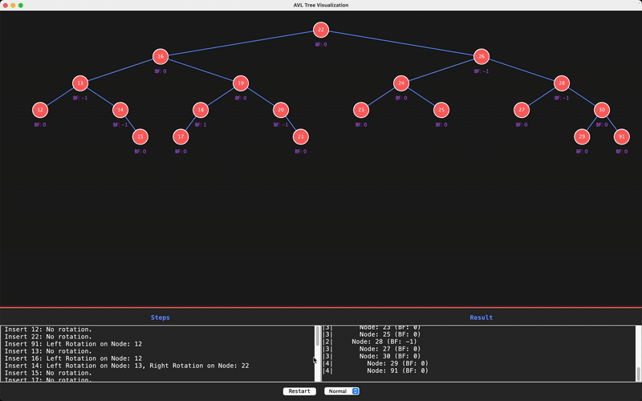

# AVL Tree Visualization

## Overview

This project provides a graphical user interface (GUI) for visualizing the operations of an AVL tree, a self-balancing binary search tree. The AVL tree ensures that the tree remains balanced after insertions by performing necessary rotations. The GUI allows users to observe the step-by-step insertion process, including the balancing rotations, and displays the tree structure along with traversal results.

## Features

- **Interactive Visualization**: Visualize the AVL tree structure with nodes, edges, and balance factors.
- **Step-by-Step Insertion**: Observe the insertion process with animations for rotations.
- **Traversal Results**: Display pre-order, in-order, and post-order traversal results.
- **Animation Control**: Adjust the animation speed (Slow, Normal, Fast).
- **Restart Functionality**: Restart the insertion process with a single button click.
- **Detailed Logging**: View detailed steps of the insertion process, including rotations performed.

## How to Use

1. **Clone the Repository**:
   ```bash
   git clone https://github.com/durgenious/avl-tree-visualization.git
   cd avl-tree-visualization
   ```

2. **Compile and Run**:
    - Ensure you have Java installed.
    - Compile the Java files:
      ```bash
      javac *.java
      ```
    - Run the `AVLTreeDemo` class:
      ```bash
      java AVLTreeDemo
      ```

3. **Using the GUI**:
    - The GUI will open, displaying an empty AVL tree.
    - The insertion process will start automatically, inserting keys one by one.
    - Observe the tree structure, balance factors, and traversal results in the GUI.
    - Use the speed control to adjust the animation speed.
    - Click the "Restart" button to reset the tree and start the insertion process again.

## Code Structure

- **AVLNode.java**: Represents a node in the AVL tree.
- **AVLTreeInterface.java**: Defines the interface for the AVL tree operations.
- **AVLTree.java**: Implements the AVL tree, including insertion, balancing, and traversal methods.
- **AVLTreeVisualizer.java**: Provides the GUI for visualizing the AVL tree.
- **AVLTreeDemo.java**: The main class to run the AVL tree visualization.

## Example

Here is an example of how the AVL tree is visualized:

1. **Initial State**: The tree is empty.
2. **Insertion**: Keys are inserted one by one, and the tree is balanced after each insertion.
3. **Rotations**: If a rotation is needed to balance the tree, the GUI will animate the rotation.
4. **Final State**: After all keys are inserted, the final tree structure and traversal results are displayed.

## Customization

You can customize the keys to be inserted by modifying the `keys` array in the `AVLTreeDemo` class:

```java
int[] keys = {12, 22, 91, 13, 16, 14, 15, 17, 18, 19, 20, 21, 23, 24, 25, 26, 27, 28, 29, 30};
```

Uncomment alternative arrays or create your own to visualize different sets of keys.

## Visualization


## Dependencies

- Java Development Kit (JDK) 8 or higher.
- No external libraries are required.

## License

This project is licensed under the MIT License. See the [LICENSE](LICENSE) file for details.

## Contributing

Contributions are welcome! Please fork the repository and submit a pull request with your changes.

## Acknowledgments

- This project was inspired by the need to visually understand AVL tree operations.
- Special thanks to the Java Swing library for providing the tools to create the GUI.

## Contact

For any questions or suggestions, please contact durgeshcgowda@gmail.com.

---

Enjoy visualizing AVL trees with this interactive tool!
